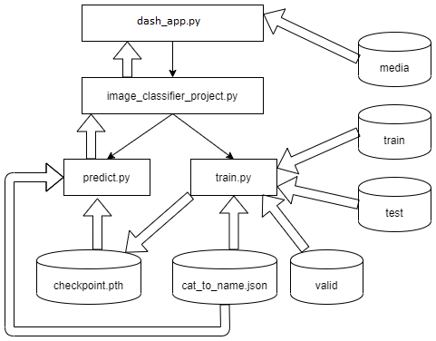
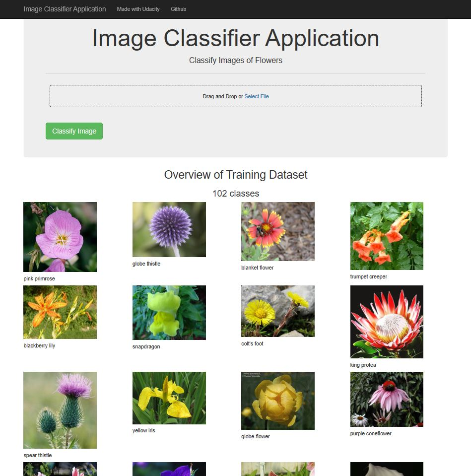
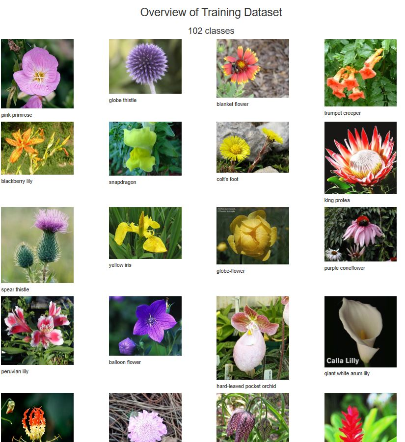
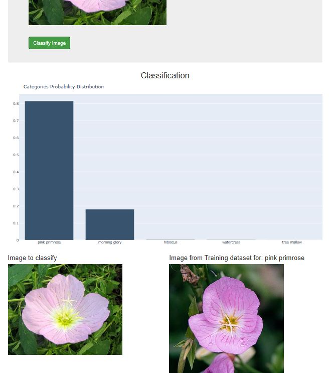

# Image Classifier Project

## Introduction

This project is part of The [Udacity](https://eu.udacity.com/) Data Scientist Nanodegree Program which is composed by:
* Term 1
    * Supervised Learning
    * Deep Learning
    * Unsupervised Learning
* Term 2
    * Write A Data Science Blog Post
    * Disaster Response Pipelines
    * Recommendation Engines

The goal of this project is to train an image classifier to recognize different species of flowers

## Software and Libraries
This project uses Python 3.7.2 and the following libraries:
* [NumPy](http://www.numpy.org/)
* [Pandas](http://pandas.pydata.org)
* [scikit-learn](http://scikit-learn.org/stable/)
* [Matplotlib](http://matplotlib.org/)
* [seaborn](https://seaborn.pydata.org/)
* [PyTorch](https://pytorch.org/)
* [Pillow](https://pillow.readthedocs.io/en/stable/)

More informations in `requirements.txt`. To create it I have used `python -m pip freeze > requirements.txt`. To install all Python packages written in the requirements.txt file run `pip install -r requirements.txt`.

## Data
The dataset is provided by [Udacity](http://www.robots.ox.ac.uk/~vgg/data/flowers/102/index.html) and is composed by:
* **flowers/test**: .jpg images for test
* **flowers/train** .jpg images to train the classifier
* **flowers/valid** .jpg images for validation
* **cat_to_name.json**: dictionary mapping the integer encoded categories to the actual names of the flowers

This set contains images of flowers belonging to 102 different categories. The images were acquired by searching the web and taking pictures. The images have large scale, pose and light variations. In addition, there are categories that have large variations within the category and several very similar categories

More information in [this paper](http://www.robots.ox.ac.uk/~vgg/publications/2008/Nilsback08) by M. Nilsback, A. Zisserman

## Running the code

The code is provided in a [Jupyter Notebook](http://ipython.org/notebook.html) then converted in a dash application

<pre>
|-- image_classifier_project
    |-- classifier
    |   |-- train.py
    |   |-- checkpoint.pth
    |
    |-- data
    |   |-- cat_to_name.json
    |   |-- flowers
    |       |-- test
    |       |-- train
    |       |-- valid
    |
    |-- images
    |-- media
    |-- image_classifier_project.ipynb
    |-- check_pytorch.py
    |-- dash_image_classifier_project.py
    |-- image_classifier_project.py
    |-- predict.py
    |-- README.md
</pre>

If you download Jupyter Notebook simply run the command `jupyter notebook image_classifier_project.ipynb` in the folder were the file is located to check out load data, Building and training the classifier an testing.
From the project folder run `python dash_image_classifier_project.py` to start the dash application. The default url to connect to it is http://127.0.0.1:8050/

If the application does not find the **checkpoint.pth** checkpoint file to load the model it will train the model (save it in **classifier/checkpoint.pth**) to get the application ready to classify images in real time

Flowchart made using [draw.io](https://about.draw.io/)

All the modules provide the help funcionality provided by [argparse](https://docs.python.org/3/library/argparse.html) module.

If while training the classifier you get `RuntimeError: CUDA out of memory. Tried to allocate ... ` try reducing your `BATCH_SIZE`. More info [here](https://stackoverflow.com/questions/61234957/how-to-solve-cuda-out-of-memory-tried-to-allocate-xxx-mib-in-pytorch)

## Results

The dash application 

When no image is give in input the application gives an overview of the dataset in the home page

When an image is submitted with the **Classify Message** button the resulting categories are shown

Results are better explained in this [blog post](https://medium.com/@simone.rigoni01/do-you-know-this-flower-image-classifier-using-pytorch-1d45c3a3df1c)

## TODO

* 0 - Delete this TODO section when all the tasks are working properly
* 1 - In image_classifier_project.py: can be intresting to plot how many images we have for each class

## Licensing and Acknowledgements

Thank you Udacity for the datasets and more information about the licensing of the data can be find [here](http://www.robots.ox.ac.uk/~vgg/data/flowers/102/index.html)
