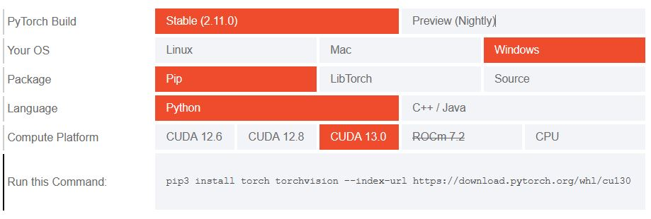
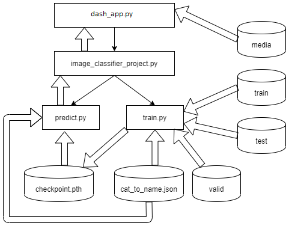
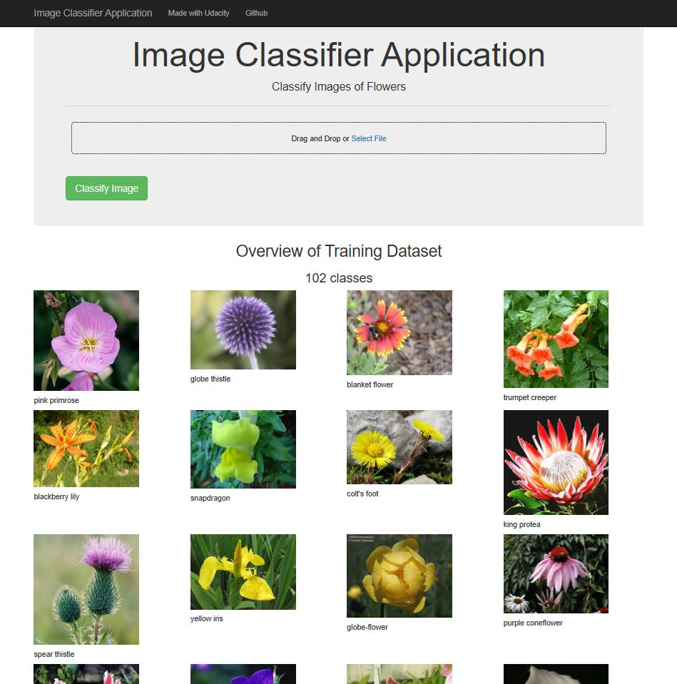
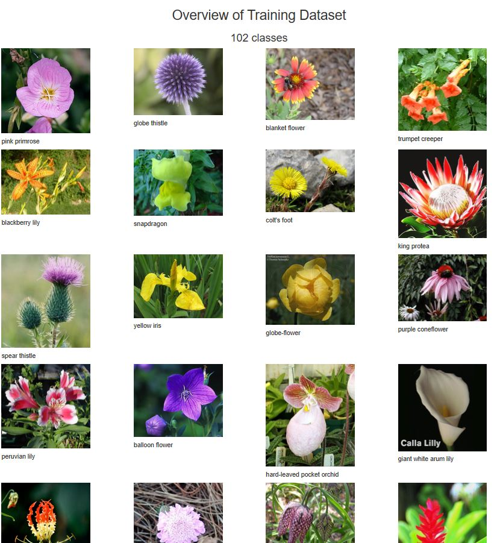
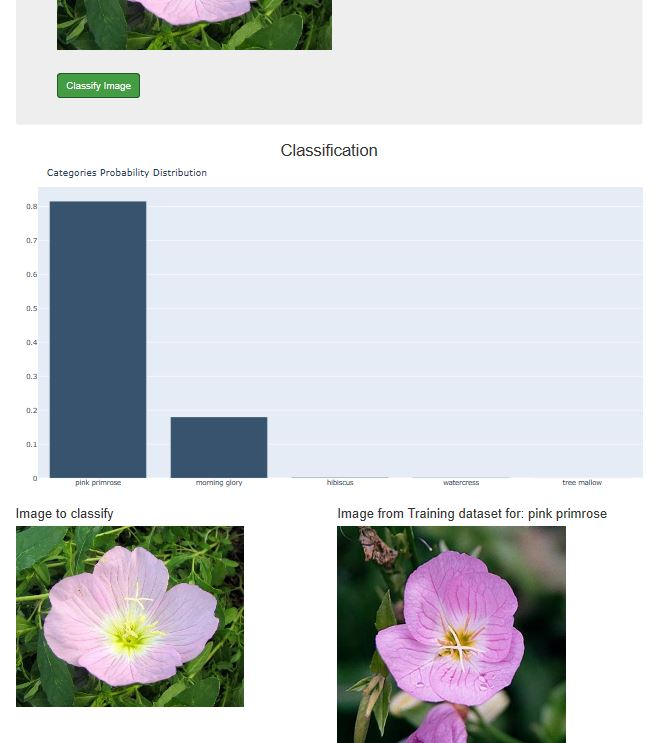

# Image Classifier Project

## Introduction

This project is part of The [Udacity](https://eu.udacity.com/) Data Scientist Nanodegree Program which is composed by:

* Term 1
    * Supervised Learning
    * Deep Learning
    * Unsupervised Learning
* Term 2
    * Write A Data Science Blog Post
    * Disaster Response Pipelines
    * Recommendation Engines

The goal of this project is to train an image classifier to recognize different species of flowers.

## Software and Libraries

This project uses Python 3.11 and the most important packages are:

- [NumPy](http://www.numpy.org/)
- [Pandas](http://pandas.pydata.org)
- [Matplotlib](http://matplotlib.org/)
- [seaborn](https://seaborn.pydata.org/)
- [PyTorch](https://pytorch.org/)
- [scikit-learn](http://scikit-learn.org/stable/)
- [dash](https://plot.ly/dash/)

If your system support CUDA make sure to follow this [guide](https://pytorch.org/get-started/locally/). 

Check if your system has an NVIDIA GPU and CUDA installed with the command `nvidia-smi`. In my case I have CUDA version 12.8 so the command will be: 

## Data

Have a look at the `data` folder and its [DATA.md](data/DATA.md) file.

## Local configuration

To setup a new local enviroment and install all dependencies you can run `.\my_scripts\Set-Up.ps1`. It will install:

* [Python](https://www.python.org/)
* [uv](https://docs.astral.sh/uv/)
* [Pre-commit](https://pre-commit.com/)

## Code Quality

Code quality is maintained through automated checks and linting using pre-commit.

Pre-commit is a framework for managing and maintaining multi-language pre-commit hooks. A pre-commit hook is a script that runs before a commit operation in a version control system. This allows to shift left code quality checks and remediations. You can change the hooks by updateing the file `.pre-commit-config.yaml`.

To trigger the pre-commit hooks without an actual commit you can run `pre-commit run --all-files -v`.

It is also possible to run manully the individual tools:

- `uv run ruff check --fix`
- `uv run ruff format .`
- `uv run pyright .`

## Testing

Tests are implemented using `pytest` and coverage is tracked with `pytest-cov`. The detailed coverage report is genarated by the pre-commit hook and it is available in [COVERAGE.md](COVERAGE.md) file.

It is also possible to run manully the individual tests:

- `uv run pytest`
- `uv run pytest tests/test_dummy.py::test_dummy`

## Running the code

Following the project instructions I have completed the provided notebook `image_classifier_project.ipynb`

Then I have used this notebook to write the scripts:

1. `train.py.py`
2. `predict.py`

Finally I have developed `image_classifier_project.py` to put everything toghether.

To make the project a bit more interactive I developed also the  dash application `dash_app.py`.

### Notebook

`image_classifier_project.ipynb` is a [Jupyter Notebook](http://ipython.org/notebook.html). 

### Console

You can run `python image_classifier_project.py`.

### Web app

You can run `python dash_app.py` to start the dash application. The default url to connect to it is http://127.0.0.1:8050/.

In any case if the **data/checkpoint.pth** is not found the code will train the model, save it and load it to be able to classify images in real time.

Flowchart made using [draw.io](https://about.draw.io/)

All the modules provide the help funcionality provided by [argparse](https://docs.python.org/3/library/argparse.html) module.

If while training the classifier you get `RuntimeError: CUDA out of memory. Tried to allocate ... ` try reducing your `BATCH_SIZE`. More info [here](https://stackoverflow.com/questions/61234957/how-to-solve-cuda-out-of-memory-tried-to-allocate-xxx-mib-in-pytorch)

## Results

The dash application 

When no image is give in input the application gives an overview of the dataset in the home page

When an image is submitted with the **Classify Message** button the resulting categories are shown

## List of activities

In the [TODO.md](TODO.md) file you can find the list of tasks and on going activities.

## Licensing and Acknowledgements

Have a look at [LICENSE.md](LICENSE.md) and many thanks to [Udacity](https://eu.udacity.com/) for the dataset. More information about the licensing of the data can be found [here](http://www.robots.ox.ac.uk/~vgg/data/flowers/102/index.html).

## Outro

I hope this repository was interesting and thank you for taking the time to check it out. On my Medium you can find a more in depth [story](https://simone-rigoni01.medium.com/do-you-know-this-flower-image-classifier-using-pytorch-1d45c3a3df1c) and on my Blogspot you can find the same [post](https://simonerigoni01.blogspot.com/) in italian. Let me know if you have any question and if you like the content that I create feel free to [buy me a coffee](https://www.buymeacoffee.com/simonerigoni).
