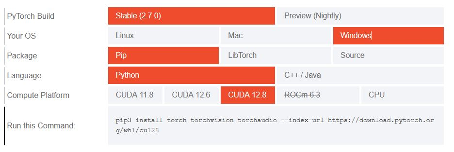

# Image Classifier Project

## Introduction

This project is part of The [Udacity](https://eu.udacity.com/) Data Scientist Nanodegree Program which is composed by:
* Term 1
    * Supervised Learning
    * Deep Learning
    * Unsupervised Learning
* Term 2
    * Write A Data Science Blog Post
    * Disaster Response Pipelines
    * Recommendation Engines

The goal of this project is to train an image classifier to recognize different species of flowers.

## Software and Libraries

This project uses Python 3.11.9 and the most important packages are:

- [NumPy](http://www.numpy.org/)
- [Pandas](http://pandas.pydata.org)
- [Matplotlib](http://matplotlib.org/)
- [seaborn](https://seaborn.pydata.org/)
- [PyTorch](https://pytorch.org/)
- [scikit-learn](http://scikit-learn.org/stable/)
- [dash](https://plot.ly/dash/)

If your system support CUDA make sure to follow this [guide](https://pytorch.org/get-started/locally/). 

Check if your system has an NVIDIA GPU and CUDA installed with the command `nvidia-smi`. In my case I have CUDA version 12.8 so the command will be: 

If you have a different version please remember to update the line 

<pre>
torch==2.7.0+cu128
</pre>

in `requirements.txt` file.

To setup a new local enviroment and install all dependencies you can run `.\my_scripts\Set-Up.ps1`

Alternatively to create the virtual enviroment you can run `python -m venv .venv`.

More informations in `requirements.txt`. I am providing a simplified version of the file and letting pip handle the dependencies to avoid maintenance overhead.

To create a complete requirements file you can run `pip freeze > requirements.txt` and to install all python packages in it you can run `pip install -r requirements.txt`.

## Data

The dataset is provided by [Udacity](http://www.robots.ox.ac.uk/~vgg/data/flowers/102/index.html) and is composed by:
* **data/flowers/test**: .jpg images for test
* **data/flowers/train** .jpg images to train the classifier
* **data/flowers/valid** .jpg images for validation
* **data/cat_to_name.json**: dictionary mapping the integer encoded categories to the actual names of the flowers

This set contains images of flowers belonging to 102 different categories. The images were acquired by searching the web and taking pictures. The images have large scale, pose and light variations. In addition, there are categories that have large variations within the category and several very similar categories

More information in [this paper](http://www.robots.ox.ac.uk/~vgg/publications/2008/Nilsback08) by M. Nilsback, A. Zisserman

## Workflow

Following the project instructions I have completed the provided notebook `image_classifier_project.ipynb`

Then I have used this notebook to write the scripts:

1. `train.py.py`
2. `predict.py`

Finally I have developed `image_classifier_project.py` to put everything toghether.

To make the project a bit more interactive I developed also the  dash application `dash_app.py`.

## Testing

You can run `.\my_scripts\Test.ps1`.

Alternatively from the project folder run `pytest`

To run a single test: `pytest .\tests\test_config.py::test_dummy`

## Code styling

[PEP8](https://peps.python.org/pep-0008/) is the style guide for Python code, and it's good practice to follow it to ensure your code is readable and consistent.

To check and format my code according to PEP8 I am using:
- [pycodestyle](https://pypi.org/project/pycodestyle/): tool to check the code against PEP 8 conventions.
- [autopep8](https://pypi.org/project/autopep8/): tool to automatically format Python code according to PEP 8 standards.

You can run `.\my_scripts\FormatAndLint.ps1`.

Alternatively to run pycodestyle on all files in the project folder and create a report: `pycodestyle --statistics --count . > code_style\report.txt`

To run autopep8 on all files in the project folder: `autopep8 --recursive --in-place .`

I prefere to check and update one file at the time because the previous recursive commands affect also `.\venv\` files. For example:

`pycodestyle .\utils\config.py > .\code_style\config_report.txt`

`autopep8 --in-place .\utils\config.py`

## Running the code

### Notebook

`image_classifier_project.ipynb` is a [Jupyter Notebook](http://ipython.org/notebook.html). 

### Console

You can run `python image_classifier_project.py`.

### Web app

You can run `python dash_app.py` to start the dash application. The default url to connect to it is http://127.0.0.1:8050/.

In any case if the **data/checkpoint.pth** is not found the code will train the model, save it and load it to be able to classify images in real time.

Flowchart made using [draw.io](https://about.draw.io/)

All the modules provide the help funcionality provided by [argparse](https://docs.python.org/3/library/argparse.html) module.

If while training the classifier you get `RuntimeError: CUDA out of memory. Tried to allocate ... ` try reducing your `BATCH_SIZE`. More info [here](https://stackoverflow.com/questions/61234957/how-to-solve-cuda-out-of-memory-tried-to-allocate-xxx-mib-in-pytorch)

## Results

The dash application 

When no image is give in input the application gives an overview of the dataset in the home page

When an image is submitted with the **Classify Message** button the resulting categories are shown

## List of activities

In the [TODO](TODO.md) file you can find the list of tasks and on going activities.

## Licensing and Acknowledgements

Have a look at [LICENSE](LICENSE.md) and many thanks to [Udacity](https://eu.udacity.com/) for the dataset. More information about the licensing of the data can be found [here](http://www.robots.ox.ac.uk/~vgg/data/flowers/102/index.html).

## Outro

I hope this repository was interesting and thank you for taking the time to check it out. On my Medium you can find a more in depth [story](https://simone-rigoni01.medium.com/do-you-know-this-flower-image-classifier-using-pytorch-1d45c3a3df1c) and on my Blogspot you can find the same [post](https://simonerigoni01.blogspot.com/) in italian. Let me know if you have any question and if you like the content that I create feel free to [buy me a coffee](https://www.buymeacoffee.com/simonerigoni).
